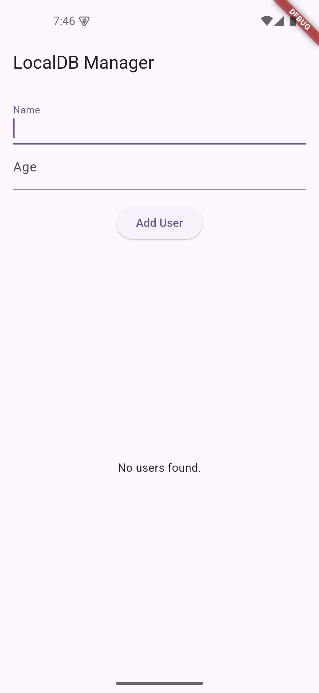
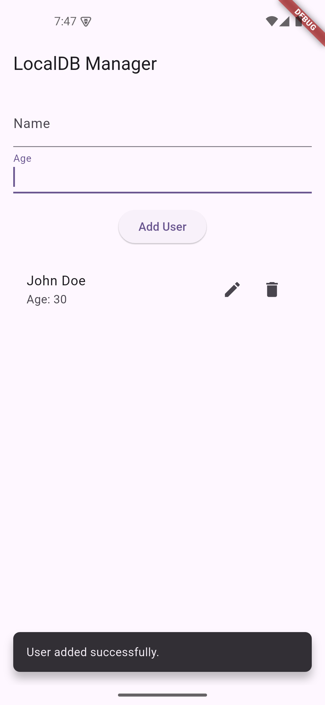
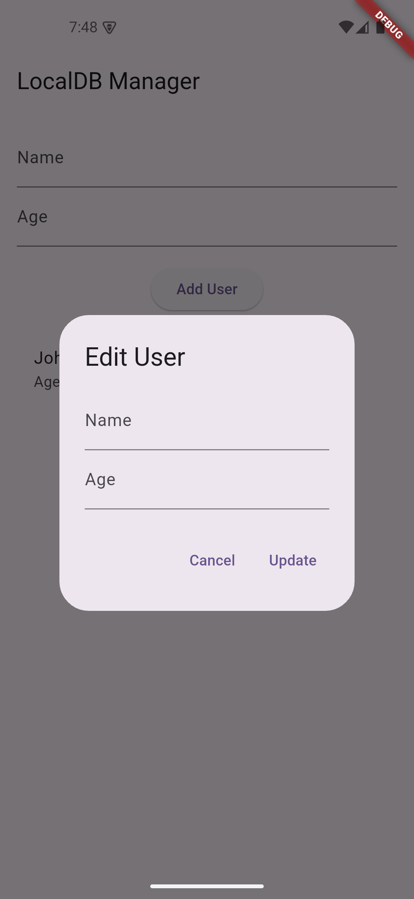
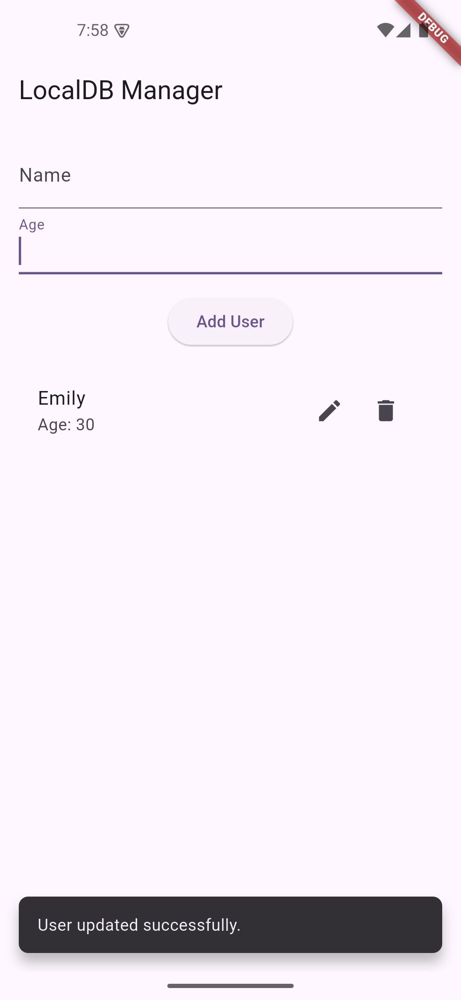
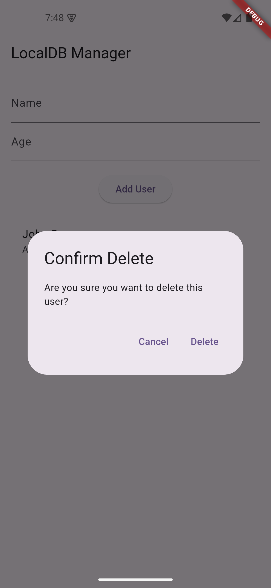
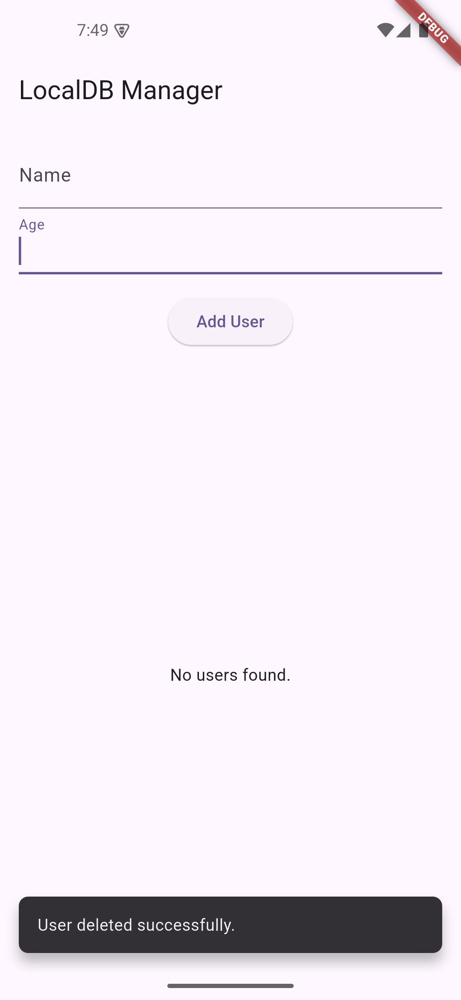

# 📂 LocalDB Manager App  

A simple **CRUD (Create, Read, Update, Delete) app** using **sqflite** for local database storage in Flutter. This app allows users to store, retrieve, update, and delete records from an SQLite database with a clean and intuitive UI.  


## ✨ Features  

- **Add Users** – Users can enter their name and age to store in the local database.  
- **View Users** – Displays a list of all saved users from the database.  
- **Update Users** – Modify existing user details via an edit option.  
- **Delete Users** – Remove users from the database with a confirmation prompt.  
- **Error Handling** – Proper exception handling and UI feedback using SnackBars.  


## 📸 Screenshots  
<p align="center">
    
    
    
    
    
    
</p>


## 📦 Dependencies  

| Package          | Purpose                                         |  
|-----------------|-------------------------------------------------|  
| `sqflite`       | SQLite database for storing local user records. |  
| `path` | Handles file path operations.  |  

Install dependencies using:  
```sh
flutter pub get
```

## Installation

1️. Clone the repository:
```bash
git clone https://github.com/your-username/localdb-manager-app.git  # Replace with your actual repository URL
```

2️. Navigate to the project directory:
```bash
cd localdb-manager-app
```

3. Install dependencies:
```bash
flutter pub get
```

4. Run the app:
```bash
flutter run
```

## 💡 Usage Guide

- Add a User → Enter a name and age, then tap "Add User".
- Update a User → Tap the edit icon, modify details, and save.
- Delete a User → Tap the delete icon and confirm.
- View Stored Users → All users are displayed on the home screen.
